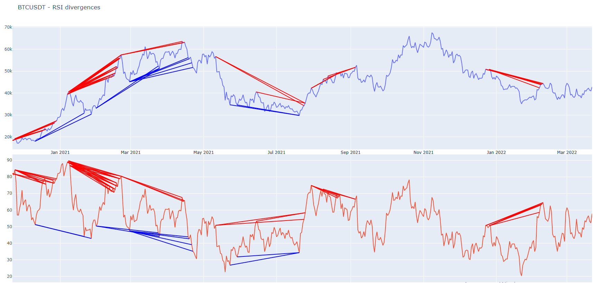

# RSI-divergence-detector
> Relative Strength Index Divergence Detector

**RSI divergence detector finds regular and hidden bullish and bearish divergences for given data**

The underlying algorithm of this project has been used to detect and post RSI divergence signals for some top coins on Binance [here](https://twitter.com/rsindicator) on Twitter and [here](https://t.me/relative_strength_index) on Telegram

## Usage

This project uses [TaLib](https://github.com/mrjbq7/ta-lib) library for some calculations, so [install](https://github.com/mrjbq7/ta-lib#installation) the TaLib library first.
Then clone the project and install other requirements.

```bash
$ git clone git@github.com:SpiralDevelopment/crypto-hft-data.git
$ cd crypto-hft-data
$ pip3 install virtualenv
$ virtualenv env
$ source env/bin/activate
$ pip3 install -r requirements.txt
```

### Samples

- sample_tg_poster.py - Gets the ohlc data from local MySql database and checks if the last closed candle forms any form of RSI divergence with candles from the past. 
  This script is used [here](https://t.me/relative_strength_index) in Telegram channel to detect and post RSI divergence signals
- sample_binance.py - Gets the data from Binance API and plots ALL detected RSI divergences during that period

## Result

Here is the result of detected RSI divergences for BTCUSDT symbol during 22.11.2020-22.03.2022 period. 

<p align="center"></p>

- Blue lines - Regular and hidden Bullish divergences
- Red lines - Regular and hidden Bearish divergences 

## License
[MIT License](https://github.com/SpiralDevelopment/RSI-divergence-detector/blob/main/LICENSE)
